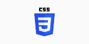

# Introduction : Bienvenue dans le monde du développement web !

<p align="center">
  
  
  
</p>

Ce cours est conçu pour vous apprendre à créer des sites web en utilisant **HTML**, **CSS** et **JavaScript**.  
Nous partirons de zéro, sans connaissances préalables, et vous serez guidés pas à pas pour construire votre première page web interactive.  
Le cours est interactif : vous allez coder, expérimenter et collaborer !

## Objectifs du cours

- Comprendre les bases de HTML, CSS et JavaScript.  
- Configurer un environnement de développement simple.  
- Créer une page web interactive.  
- Travailler en groupe sur des exercices pratiques.  

---

# Partie 0 : Une brève histoire des sites web et de leurs langages

Avant de plonger dans le code, comprenons d'où viennent les sites web et les langages que nous allons utiliser.  
Le web a transformé la façon dont nous communiquons, apprenons et partageons des informations !

## Les débuts du web
- **1989** : ***Tim Berners-Lee***, un scientifique britannique, invente le World Wide Web au CERN (Suisse).  
    Son idée était de créer un système pour partager des informations entre chercheurs via des ordinateurs connectés.  
- **1990** : Le premier site web est créé. Il était très simple, avec du texte et des liens hypertextes (pas d'images ni de couleurs !).  

## L'évolution des langages

- **HTML (1990)** : HTML, ou *HyperText Markup Language*, est créé par Tim Berners-Lee pour structurer le contenu du web.  
    La première version (HTML 1.0) permettait d'afficher du texte, des titres et des liens.  
  Aujourd'hui, **HTML5** (la version actuelle) permet d'ajouter des vidéos, des animations et bien plus.  

- **CSS (1996)** : *Cascading Style Sheets* arrive pour rendre les sites plus beaux.  
    Avant CSS, les pages web étaient fades et difficiles à styliser.  
  CSS a permis de **séparer le contenu (HTML) du design** (couleurs, polices, mise en page).  

- **JavaScript (1995)** : Créé par Brendan Eich, JavaScript a rendu le web interactif.  
    Avant, les sites étaient statiques (comme un livre).  
    Avec JavaScript, on peut ajouter des boutons, des formulaires dynamiques et des animations.
    
<div style="text-align: center;">
    
    <br>
    <a href="https://fr.wikipedia.org/wiki/Tim_Berners-Lee">Rasmus Lerdorf - Wikipédia</a>
</div>


## Le web aujourd'hui

Aujourd'hui, presque tout ce que vous faites en ligne (réseaux sociaux, jeux, streaming) repose sur HTML, CSS et JavaScript.  
Ces trois langages sont les **piliers du développement web** :

- **HTML** donne la structure (comme les murs d'une maison).  
- **CSS** ajoute le style (comme la peinture et la décoration).  
- **JavaScript** apporte l’interactivité (comme les interrupteurs et les gadgets).  

## 🎯 Activité : Réflexion en groupe

- Regardez un site web simple (ex. : [wikipedia.org](https://wikipedia.org)). Essayez d'imaginer :
  - Quel rôle joue **HTML** ? (Indice : cherchez la structure, comme les titres ou les paragraphes.)  
  - Quel rôle joue **CSS** ? (Indice : regardez les couleurs et la mise en page.)  
  - Où pourrait être **JavaScript** ? (Indice : cherchez des éléments interactifs, comme des menus déroulants.)  
- Partagez vos observations avec un camarade !

---

# Partie 0.1 : Outils en ligne pour s'entraîner et apprendre

Pour progresser en HTML, CSS et JavaScript, il est essentiel de **pratiquer**.  
Voici une sélection d’outils en ligne gratuits et interactifs qui rendent l’apprentissage amusant et efficace.

## Outils recommandés

1. **Flexbox Froggy** - [flexboxfroggy.com](https://flexboxfroggy.com)  
    Un jeu interactif pour apprendre les concepts de CSS Flexbox.  
   **Activité** : Essayez les 3 premiers niveaux et discutez en groupe de ce que vous avez appris sur `justify-content` ou `align-items`.

2. **CSS Grid Garden** - [cssgridgarden.com](https://cssgridgarden.com)  
    Un autre jeu amusant pour apprendre CSS Grid.  
   **Activité** : Complétez un niveau et partagez comment vous avez utilisé `grid-template-columns`.

3. **CodePen** - [codepen.io](https://codepen.io)  
    Une plateforme pour coder HTML, CSS et JavaScript dans un éditeur en ligne.  
   **Activité** : Créez un compte, recréez votre page `index.html` sur CodePen et partagez-la avec un camarade.

4. **W3Schools** - [w3schools.com](https://www.w3schools.com)  
    Un site avec des tutoriels interactifs.  
   **Activité** : Suivez un tutoriel sur les sélecteurs CSS et testez vos connaissances.

5. **FreeCodeCamp** - [freecodecamp.org](https://www.freecodecamp.org)  
    Une plateforme gratuite avec des cours structurés et des projets pratiques.  
   **Activité** : Commencez le module *Responsive Web Design* et complétez une leçon HTML ou CSS.

6. **CSS Diner** - [css-diner.com](https://css-diner.com)  
    Un jeu pour apprendre les sélecteurs CSS.  
   **Activité** : Terminez les 5 premiers niveaux et expliquez ce que fait le sélecteur `:nth-child`.

## 💡 Conseils pour utiliser ces outils

- **Pratiquez régulièrement** : 10 à 15 minutes par jour suffisent.  
- **Partagez vos progrès** : Obtenez des retours !  
- **Explorez et expérimentez** : Modifiez le code, testez des idées !

---

# Partie 1 : Préparer les outils

Avant de coder, il faut préparer un **environnement de travail**.

## 1.1 Outils nécessaires

- **Éditeur de texte** : Visual Studio Code (recommandé)  
    - Téléchargez sur : [code.visualstudio.com](https://code.visualstudio.com)  
    - Installez-le sur votre ordinateur.

- **Navigateur web** : Google Chrome, Firefox, etc.  
    - Utilisez l’inspecteur (clic droit > "Inspecter") pour voir comment fonctionne le code.

- **Dossier de travail** :  
    - Créez un dossier nommé `mon_premier_site`.  
    - Créez-y des fichiers `.html`, `.css` et `.js`.

## 1.2 🛠️ Activité : Configurer son environnement

1. Téléchargez et installez **Visual Studio Code**.  
2. Créez un dossier **`mon_premier_site`** sur votre bureau.  
3. Ouvrez ce dossier dans **VS Code (Fichier > Ouvrir un dossier)**.  
4. Créez un fichier **`index.html`** avec le contenu suivant :

    ```html
    <!DOCTYPE html>
    <html lang="fr">
    <head>
        <meta charset="UTF-8">
        <title>Ma première page web</title>
    </head>
    <body>
        <h1>Bonjour, le monde !</h1>
    </body>
    </html>
    ```

# Partie 2 : Les bases de HTML

**HTML** (*HyperText Markup Language*) structure le contenu d’une page web.  
Il forme le squelette d’un site avec des titres, paragraphes, images et liens.

## 2.1 Concepts clés

- **Balises** : Délimitées par `<` et `>`, souvent ouvertes et fermées (ex : `<p>` et `</p>`).  
    Certaines sont auto-fermantes : ``.

- **Attributs** : Fournissent des infos supplémentaires aux balises.  
    Exemple : `<a href="https://example.com">` où `href` est l'attribut.

- **Structure HTML typique** :
    - **`<!DOCTYPE html>`** : Déclare HTML5.
    - **`<html lang="fr">`** : Langue du document.
    - **`<head>`** : Métadonnées (titre, liens).
    - **`<body>`** : Contenu visible.

- **Balises courantes** :
    - **`<h1>`** à **`<h6>`** : Titres.
    - **`<p>`** : Paragraphe.
    - **`<a>`** : Lien hypertexte.
    - **``** : Image.
    - **`<ul>` / `<li>`** : Liste à puces.
    - **`<div>`** : Conteneur.

## ✏️ 2.2 Exemples

### 1. Structure de base

```html
<!DOCTYPE html>
<html lang="fr">
<head>
    <meta charset="UTF-8">
    <title>Mon site</title>
</head>
<body>
    <h1>Bienvenue !</h1>
    <p>Ceci est ma première page web.</p>
</body>
</html>
```

***Résultat*** : Affiche un titre "Bienvenue !" et un paragraphe.

### 2. Liste et lien :

    <h2>Mes hobbies</h2>
    <ul>
        <li>Lecture</li>
        <li>Jeux vidéo</li>
        <li><a href="https://example.com">Visiter un site</a></li>
    </ul>


***Résultat*** : Affiche une liste à puces avec un lien cliquable.

### 3. Image :

    

***Résultat*** : Affiche une image de 200x200 pixels.

## 2.3 Exercices pratiques

**À vous de jouer** : [Exercices](./html-css-js/exercises/exercices-partie2.md)

---

# Partie 3 : Les bases de CSS

**CSS** (*Cascading Style Sheets*) est un langage utilisé pour styliser une page web. Il permet de contrôler l'apparence des éléments HTML, comme les couleurs, tailles, polices et positions, pour rendre un site visuellement attrayant.

## 3.1 Concepts clés

- **Sélecteurs** : Ils ciblent les éléments HTML à styliser. Types courants :
  - Par balise : `h1 { ... }` (sélectionne tous les `<h1>`).
  - Par classe : `.ma-classe { ... }` (sélectionne les éléments avec `class="ma-classe"`).
  - Par ID : `#mon-id { ... }` (sélectionne un élément unique avec `id="mon-id"`).
- **Propriétés** : Elles définissent le style à appliquer. Exemples :
  - `color` : Couleur du texte (ex. : `navy`, `#FF0000`).
  - `font-size` : Taille du texte (ex. : `16px`, `1.2em`).
  - `background-color` : Couleur de fond (ex. : `lightblue`).
  - `margin` : Espacement extérieur.
  - `padding` : Espacement intérieur.
- **Connexion HTML-CSS** :
  - Reliez un fichier CSS externe avec `<link rel="stylesheet" href="style.css">` dans la balise `<head>`.
  - Ou intégrez le CSS directement dans une balise `<style>` dans `<head>`.
- **Box Model** : Chaque élément HTML est une "boîte" composée de :
  - Contenu (texte, images, etc.).
  - `padding` (espace interne).
  - `border` (bordure autour du contenu).
  - `margin` (espace externe).
- **Positionnement** : Contrôle la disposition des éléments. Exemples :
  - `display: block` (occupe toute la largeur).
  - `text-align: center` (centre le contenu horizontalement).

## 3.2 Exemples

**1. Style de base :**

```html
<h1 class="titre">Mon Titre</h1>
<p id="intro">Bienvenue sur mon site.</p>
.titre {
    color: navy;
    font-size: 2em;
    text-align: center;
}
#intro {
    color: gray;
    font-style: italic;
}
```

***Résultat*** : Le titre est bleu marine, centré, et le paragraphe est gris et en italique.


**2. Box Model :**

```html
<div class="boite">Contenu</div>
.boite {
    background-color: lightblue;
    padding: 15px;
    border: 2px solid black;
    margin: 20px;
}
```
    
***Résultat*** : Une boîte avec un fond bleu clair, une bordure noire, et des espaces internes/externes.

**3. Centrer une image :**

```html

img {
    display: block;
    margin: 0 auto;
    border-radius: 10px;
}
```

***Résultat*** : L’image est centrée avec des coins arrondis.

**À vous de jouer** : [Exercices](./html-css-js/exercises/exercices-partie3.md)

---

# Partie 4 : Les bases de JavaScript

**JavaScript** rend les pages web interactives en ajoutant des comportements dynamiques, comme réagir aux clics ou modifier le contenu en temps réel.

**4.1 Concepts clés**
- **Variables** : Stockent des données. Types courants :
    - let : Variable modifiable (ex. : `let age = 20;`). 
    - const : Variable non modifiable (ex. : `const nom = "Alice";`). 
- **Fonctions** : Blocs de code réutilisables. Exemple :

```js
function saluer() {
    alert("Bonjour !");
}
```

- **Événements** : Réactions aux actions des utilisateurs (ex. : `onclick, onmouseover`). 
- **Manipulation du `DOM`** : Modifie les éléments HTML. Exemple : `document.getElementById("id").innerText = "Nouveau texte";`. 
- **Connexion HTML-JavaScript** :
    - Créez un fichier `script.js` et liez-le avec `<script src="script.js"></script>` à la fin de `<body>`. 
    - Ou utilisez une balise `<script>` dans `<body>`.

**4.2 Exemples**
1. **Variable et alerte** :
```js
    <button onclick="montrerNom()">Afficher nom</button>
    function montrerNom() {
        let nom = "Marie";
        alert("Bonjour, " + nom + " !");
    }
```

***Résultat : Une alerte affiche "Bonjour, Marie !"***.

**2. Modifier le DOM** :
```js
<p id="texte">Texte original</p>
<button onclick="changerTexte()">Changer</button>
function changerTexte() {
    document.getElementById("texte").innerText = "Texte modifié !";
}
```

***Résultat*** : Le texte du `<p>` change au clic.

**3. Condition simple** :
```js
<button onclick="verifierAge()">Vérifier âge</button>
function verifierAge() {
    let age = 18;
    if (age >= 18) {
        alert("Vous êtes majeur !");
    } else {
        alert("Vous êtes mineur !");
    }
}
```

***Résultat*** : Une alerte selon la condition.

**À vous de jouer** : [Exercices](./html-css-js/exercises/exercices-partie4.md)

---

# Partie 5 : Projet en groupe - Création d'un site web interactif

**Cliquez sur le lien** : [Projet](./html-css-js/exercises/project.md)
